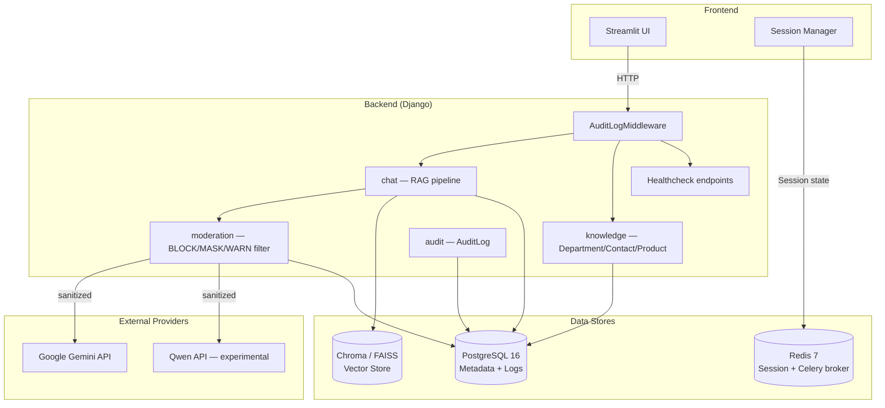
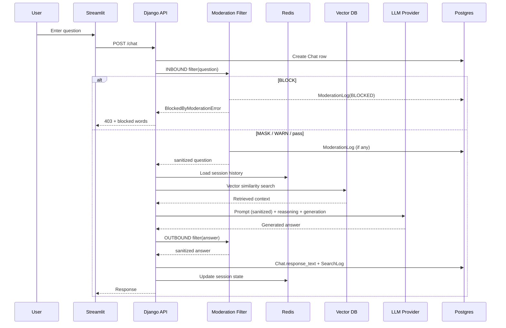
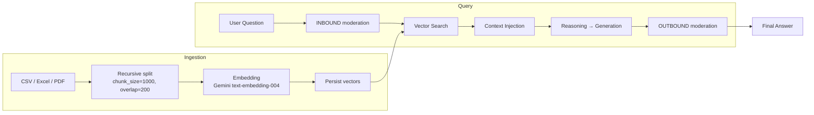

# Triple Chat Architecture
Internal RAG Q&A stack (Streamlit + Django + Postgres + Redis + FAISS/Chroma + Gemini/Qwen) built for **traceability, governance, and 대외비 데이터 보호**. Tested with Samsung Galaxy product docs; scoped for sales-team rollout.

## System Overview
- Goal: log the full chain per session (question → retrieved context → generated answer) while keeping provider choice flexible and enforcing forbidden-word policy.
- Domain: internal product / contact / department directory + Samsung Galaxy product specs (eval set).
- Stage: 영업팀 베타 직전 (Phase 0 완료 — RBAC 데이터 모델, moderation, knowledge, audit, Postgres, CI).

## Topology


## Chat Message Flow (with moderation)


## RAG Process (ingest → serve)


Chunk_size 정책의 근거: [backend/docs/chunk_experiment.md](backend/docs/chunk_experiment.md) — 영업팀 12문항 평가셋 기준 chunk_size=150이 recall@5 +4.4%p 우위.

## Data Model

### chat
- `User(user_id, uuid, email, role[USER|MANAGER|ADMIN], department→knowledge.Department, expired_datetime, last_activity)`
- `Chat(question_id, user, question_text, response_text, data, created_datetime)`
- `SearchLog(search_log_id, question, data, searching_time)`
- `RagData(data_id, data_text, image_urls)`

### knowledge
- `Department(name, description, parent[self], created_at)`
- `Contact(name, email, phone, title, department, is_primary)`
- `Product(name, category[PRODUCT|SERVICE|SOLUTION], description, specs[JSON], department, primary_contact, is_active)`

### moderation
- `ForbiddenWord(word, category, severity[BLOCK|MASK|WARNING], direction[INBOUND|OUTBOUND|BOTH], mask_replacement, is_active)`
- `ModerationLog(user, chat, detected_words, matched_categories, action[BLOCKED|WARNED|MASKED], source[INBOUND|OUTBOUND], original_excerpt, sanitized_excerpt, reviewed, reviewer_note, created_at)`

### audit
- `AuditLog(user, action, resource, resource_id, method, path, status_code, detail[JSON], ip_address, user_agent, created_at)`

> Trace 4종을 통해 "누가, 무엇을, 어떤 데이터로, 어떤 정책 하에 답했는가"를 재현 가능.

## Key Design Choices
- **Django REST**: 일관된 API + 영속성, Django Admin이 곧 운영자의 검수 페이지.
- **Postgres 16**: 동시성 + JSONField + 인덱싱. SQLite는 dev fallback.
- **Redis**: 세션 상태 / Celery broker / 캐시. TTL이 DB `expired_datetime`과 정렬됨.
- **Celery**: 로깅·벡터 빌드를 request path 밖으로.
- **Provider 추상화** (`chat/providers/manager.py`): env-driven embedding/reasoning/generation. Gemini default, Qwen 실험, Ollama 경로 문서화 ([security.md §4](backend/docs/security.md)).
- **Moderation as a middleware-of-the-LLM-call**: INBOUND과 OUTBOUND 양쪽 필터, BLOCK은 short-circuit, MASK는 치환, WARN은 로그.

## Security / Access (current)
- **DEBUG=0 + 기본 SECRET_KEY 조합 부팅 거부** (settings.py 가드)
- **CORS allowlist env-driven** (`CORS_ALLOWED_ORIGINS`)
- **Forbidden-word 다단계 필터** — 외부 LLM에 대외비/PII 노출 차단
- **AuditLogMiddleware** — 모든 mutating API 호출 기록
- **Healthcheck endpoint** — incident detection 가능
- ❌ 아직: JWT endpoint protection, HTTPS 강제, Redis AUTH, DB 컬럼 암호화 — Phase 1/2

## Logging & Governance
- Chat / SearchLog / ModerationLog / AuditLog 4개 trace 테이블 + Redis transient session.
- Django Admin이 운영자 콘솔 — `/admin/moderation/`, `/admin/knowledge/`, `/admin/audit/`.
- 모든 외부 LLM 호출은 sanitized text만 송신, 원문은 ModerationLog에만 남음.

## Scalability Notes
- Docker Compose 단일 노드 운영 기준; backend는 stateless이므로 horizontal scaling 가능 (Phase 3).
- 벡터스토어는 기동 시 재빌드 가능 (`build_vectors` management command).
- Streaming, 다국어, 멀티 노드는 후속 단계.

## Known Gaps (current)
- JWT endpoint protection 미적용 (Role 모델은 있음)
- Forbidden-word substring 매칭의 false positive 가능 → 단어 경계 정규식 강화 예정
- 외부 LLM 의존 → Stage 2 Ollama PoC 예정
- ModerationLog/AuditLog retention 정책 미구현
- 응답 SSE 스트리밍 없음
- 단일 노드, HA/auto-scale 미설계

## CI / Validation
- GitHub Actions `.github/workflows/ci.yml` — lint / Django tests against Postgres+Redis / chunk A/B harness artifact / backend+frontend Docker build.
- Retrieval eval set: [`backend/chat/tests/evals/dataset.jsonl`](backend/chat/tests/evals/dataset.jsonl) (영업팀 12문항).

## Example: Inbound moderation hook
```python
# backend/chat/views.py — ChatAPIView.post
from moderation.filter import apply as moderate_text, BlockedByModerationError
from moderation.models import ModerationLog

try:
    mod_in = moderate_text(question, source=ModerationLog.Source.INBOUND, user=user_obj, chat=chat_instance)
except BlockedByModerationError as exc:
    return Response({"error": "차단된 단어", "blocked_words": exc.words}, status=403)

# sanitized question goes to the LLM
pipeline_context = ModuleContext(question=mod_in.sanitized, ...)
```

## Related
- [README.md](../README.md) — 시스템 개요
- [backend/README.md](backend/README.md) — 백엔드 상세
- [backend/docs/security.md](backend/docs/security.md) — 보안 / 대외비 대응 / 로컬 LLM 경로
- [backend/docs/chunk_experiment.md](backend/docs/chunk_experiment.md) — chunk_size A/B 결과
- [prd.html](prd.html) — 전체 PRD (단일 HTML)
