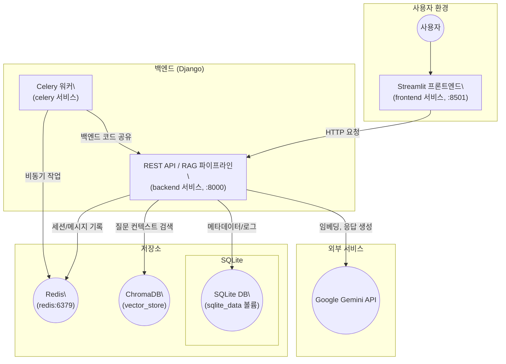

## 시스템 아키텍처 개요

backend/chat/models.py:17의 User 모델은 새 세션이 만들어질 때마다 가장 최근 사용자만 만료 처리합니다. 동시에 여러 사용자가 쓰면 엉뚱한 계정이 만료될 수 있으니, 요청이 가져온 user_id만 만료하거나 세션 토큰처럼 사용자별로 구분하는 구조가 좋습니다.

backend/chat/views.py:231에서 Redis 세션과 DB의 expired_datetime가 따로 놀고 있습니다. Redis TTL과 DB 만료 시간을 맞추고, 세션이 끊길 때 expired_datetime을 업데이트하는 로직을 추가하면 정리가 편합니다.
대화 기록을 Redis에 저장할 때 history.add_message(AIMessage(content=question)) (backend/chat/views.py:154)로 질문을 AI 역할로 넣고 있어서 히스토리가 섞입니다. 질문은 HumanMessage로, 모델 응답은 AIMessage로 따로 저장해주세요 (backend/chat/views.py:198 근처에 응답을 넣는 코드도 필요).

API 요청 처리 중 Chat, RagData, SearchLog를 순서대로 저장하는데 트랜잭션이 없습니다 (backend/chat/views.py:140). 중간에 오류가 나면 데이터가 비정상으로 남으니 transaction.atomic()을 감싸거나, 응답 생성이 끝난 뒤 한 번에 저장하는 쪽이 안전합니다.

매 요청마다 Gemini 클라이언트를 새로 만들고 있어 latency가 늘어납니다 (backend/chat/views.py:164). 초기에 한 번 생성해 재사용하거나, 의존성 주입으로 공유하는 방식이 성능상 더 낫습니다.

build_vector_store.py가 os.getcwd() 기준으로 CSV 경로를 잡고 있어 실행 위치가 바뀌면 실패합니다 (backend/chat/build_vector_store.py:123). settings.BASE_DIR 기준 절대경로로 바꿔 두면 운영이 편합니다

## React 전환 대비 API 계약 초안

- `POST /api/v1/triple/user/`
  - 요청: `{ "user_id": "선택적" }`
  - 응답: `{ "user_id": "생성 또는 재사용된 ID" }`
  - 고려: 추후 JWT 전략을 활성화할 경우 `token` 필드를 추가하고, 기존 `user_id`는 하위 호환용으로 유지합니다.

- `POST /api/v1/triple/chat/`
  - 요청: `{ "user_id": "필수", "question": "필수" }`
  - 응답: `{ "response": "LLM 답변", "chat_id": 숫자, "images": ["..."] }`
  - 고려: React 클라이언트가 streaming UX를 구현할 수 있도록 `Accept: text/event-stream`과 같은 확장도 염두에 둡니다.

- `POST /api/v1/triple/activity/`
  - 요청: `{ "user_id": "필수" }`
  - 응답: `200 OK` 또는 `{ "error": "Session expired" }`
  - 고려: JWT 사용 시에는 헤더(`Authorization: Bearer ...`) 기반 인증으로도 동작해야 하므로, Body와 헤더 두 경로를 동시에 지원하도록 설계합니다.

### 안정성 가이드
- 응답 스키마를 `OpenAPI` 문서로 고정하고 변경 시 버전을 올립니다 (`/api/v1` → `/api/v2`).
- 에러 응답은 `{ "error": 코드, "message": 상세 }` 구조로 통일하여 React에서 일관되게 처리하게 합니다.
- 비호환 변경은 `deprecation` 헤더와 함께 최소 한 버전 이상 유지한 뒤 제거합니다.

## Docker 기반 배포 전략 (React 전환 대비)

1. **frontend 서비스**
   - Node 20 이미지를 베이스로 사용하고 `npm ci && npm run build` 후 `/app/dist`(또는 build 결과)를 Nginx 컨테이너로 전달.
   - 개발 모드에서는 `npm run dev -- --host 0.0.0.0`로 hot reload, 프로덕션에서는 정적 파일만 제공.
2. **backend 서비스**
   - 현재 Django 컨테이너 이미지를 그대로 사용하되 `gunicorn` + `whitenoise` 구성으로 스케일 가능하도록 `docker compose` 혹은 `k8s`에서 replica 수를 조절.
   - 환경 변수는 `.env` 혹은 secrets manager에서 주입하고 `SESSION_JWT_SECRET` 등을 분리 관리.
3. **redis / celery**
   - 기존 정의 유지. Celery 비동기 작업이 증가하면 워커 수를 `docker compose up --scale celery=3` 형태로 조절 가능.
4. **볼륨 전략**
   - `sqlite_data` 대신 프로덕션에서는 RDS 같은 외부 DB를 고려하되, 데모 단계에서는 현재 볼륨을 유지합니다.
   - `vector_store`는 빌드 결과를 컨테이너 스타트업 훅에서 체크하고 없으면 자동 구축하도록 스크립트를 추가합니다.
5. **CI/CD**
   - `docker compose build` 및 테스트를 GitHub Actions에서 수행하고, 레지스트리에 이미지를 푸시한 뒤 서버에서는 `docker compose pull && docker compose up -d`로 배포.

## 모델 Provider 전략 요약

- `backend/chat/providers/manager.py`에서 임베딩·추론·생성 모델을 환경 변수 기반으로 선택합니다.
- 기본값은 Gemini이지만 `REASONING_PROVIDER=qwen`, `GENERATION_PROVIDER=qwen` 등으로 조합을 바꿀 수 있습니다.
- 상세 사용법은 `backend/docs/provider_architecture.md`를 참고하세요.
- `/api/v1/triple/providers/` 엔드포인트와 Streamlit 사이드바 토글로 세션별 provider 조합을 실시간으로 변경할 수 있습니다.

이 구성은 “Streamlit UI + Django API + ChromaDB + Redis + Genimi + Celery”가 느슨하게 결합돼 있어, 빠르게 PoC를 만들고 기능을 추가하기 쉬운 장점이 있습니다. 프론트엔드와 백엔드를 분리하면 API 재사용, 배포 분리, 권한·보안 설정 등을 상황에 맞게 확장할 수 있고, Redis·Chroma처럼 용도별 저장소를 쓰면 RAG 품질을 개선하고 세션/캐시도 안정적으로 관리할 수 있어요. Celery는 반드시 필요한 건 아니지만, 향후 벡터 빌드나 로그 집계 같은 작업을 비동기로 넘길 수 있는 발판이 됩니다.
다만 팀 규모가 작고 운영 단순화가 우선이라면 구조를 줄일 수도 있습니다. 예를 들어 한 컨테이너에서 Streamlit+Django를 동시에 돌리고, Redis 없이 세션을 DB나 Streamlit session_state에 보관하는 방법도 있어요. 또 Chroma 대신 FAISS 같은 인메모리 인덱스를 사용하면 의존성이 줄어듭니다.
결국 선택은 목표와 운영 부담에 달렸습니다. 향후 제품화·다중 사용자·운영 안정성을 중시한다면 지금처럼 역할을 분리한 구조가 도움이 되고, 단일 사용자 데모 수준이라면 더 간단한 아키텍처도 충분할 수 있습니다. 어떤 방향으로 갈지 결정하면 거기에 맞춰 설계를 다시 다듬어드릴게요.
