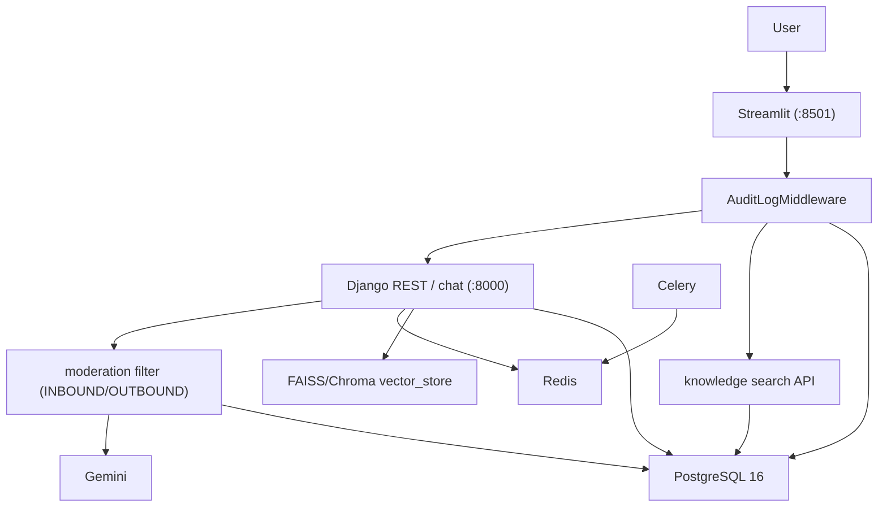

## System Architecture (snapshot)

```mermaid
graph TB
    User --> UI["Streamlit (:8501)"]
    UI --> Mw["AuditLogMiddleware"]
    Mw --> API["Django REST / chat (:8000)"]
    Mw --> KB["knowledge search API"]
    API --> Mod["moderation filter (INBOUND/OUTBOUND)"]
    Mod --> Gemini
    API --> Redis
    API --> Chroma["FAISS/Chroma vector_store"]
    API --> Postgres["PostgreSQL 16"]
    KB --> Postgres
    Mod --> Postgres
    Mw --> Postgres
    Celery --> Redis
```

## Code Fixes — status

| 항목 | 상태 |
|------|------|
| 만료 시 user_id 매칭하여 정확히 그 사용자만 처리 | ✅ `chat/tasks.py::check_session_expiry` (last_activity 기준) |
| Redis TTL ↔ DB `expired_datetime` 정합성 | ✅ `redis_manager.refresh_user_session()` 단일 윈도우 |
| Chat 히스토리를 `HumanMessage` / `AIMessage`로 저장 | ✅ `chat/views.py::RedisMessageHistory` |
| Chat/RagData/SearchLog 쓰기 트랜잭션 | ⚠️ 부분 — Phase 1에서 `transaction.atomic()` 래핑 예정 |
| Gemini/Qwen 클라이언트 재사용 | ✅ `providers/manager.py` 싱글톤 캐시 |
| 경로를 `settings.BASE_DIR` 기준으로 | ✅ provider/vector store 모두 |
| 인증 (JWT/RBAC) | ⏳ Role 모델 추가됨, endpoint protection은 Phase 1 |
| 금지어 필터 | ✅ `moderation` 앱 — INBOUND/OUTBOUND BLOCK/MASK/WARN |
| 감사 로그 | ✅ `audit.AuditLogMiddleware` |
| 헬스체크 | ✅ `/api/v1/triple/health/` + `/health/ready/` |
| Postgres 마이그레이션 | ✅ `DATABASE_URL`, docker-compose, `.env` 단일 (backend/README.md inline) |

## API Contract (current)

### Chat (RAG)
- POST `/api/v1/triple/user/` — body `{user_id?}` → `{user_id}`. JWT는 Phase 1.
- POST `/api/v1/triple/chat/` — body `{user_id, question}` → `{response, chat_id, images[]}`.
  - 403 응답: `{error, blocked_words[], chat_id}` (BLOCK 정책 발동)
- POST `/api/v1/triple/activity/` — body `{user_id}` → `200` 또는 `{error:"Session expired"}`.
- GET `/api/v1/triple/health/` — liveness
- GET `/api/v1/triple/health/ready/` — DB + Redis + provider readiness

### Knowledge (deterministic, no LLM)
- GET `/api/v1/knowledge/products/?q=&category=`
- GET `/api/v1/knowledge/contacts/?q=&department=`
- GET `/api/v1/knowledge/departments/`

### Admin (운영자)
- `/admin/moderation/forbiddenword/` — 단어 등록/severity 운영
- `/admin/moderation/moderationlog/` — 탐지 이력 검수
- `/admin/knowledge/` — 부서/제품/담당자 CRUD
- `/admin/audit/auditlog/` — read-only

## Deployment Notes (docker-first)

1) **권장**: `cd Rag_Chat` → `.env` 작성 ([backend/README.md](../../README.md#environment-variables-single-source-rag_chatenv) inline 템플릿) → `docker-compose up --build`
   — Postgres + Redis + backend(gunicorn) + Celery worker + beat + Streamlit 일괄 기동.
2) gunicorn + whitenoise; backend는 stateless이므로 replicas 확장 가능.
3) redis / celery: compose 정의 유지; `--scale celery=N`.
4) volumes: `postgres_data`, `redis_data`, `static_volume`. SQLite 볼륨은 폐기.
5) CI/CD: GitHub Actions(.github/workflows/ci.yml) — lint / Postgres+Redis 통합 테스트 / chunk A/B 리포트 / Docker 빌드.

## Provider Notes
- `chat/providers/manager.py` — env-driven 선택, 싱글톤 캐시.
- Session preset: `/api/v1/triple/providers/` + Streamlit sidebar.
- 대외비 등급 상향 시 — Ollama / vLLM 경로 ([backend/docs/security.md §4](../../docs/security.md)).

## Validation
- Retrieval A/B: `chat/tests/evals/run_chunk_ab.py` (BM25, recall@k) + 영업팀 12문항 평가셋.
- 실험 결과: [backend/docs/chunk_experiment.md](../../docs/chunk_experiment.md) — chunk_size=150이 recall@5 +4.4%p.

## Minimal Alternative (ops가 빠듯할 때)
- 단일 컨테이너 Streamlit + Django, SQLite + in-memory FAISS.
- Celery 생략 — request path 안에서 동기 처리. moderation/audit는 그대로 유지 (성능 영향 미미).
