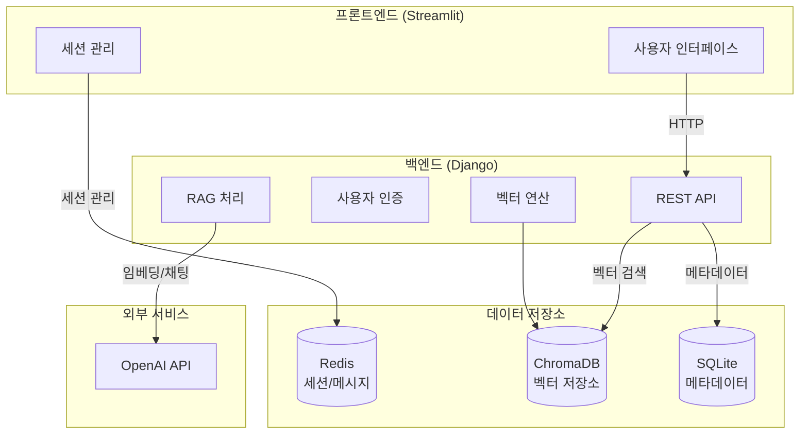
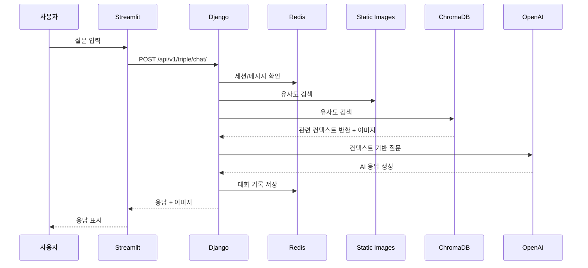
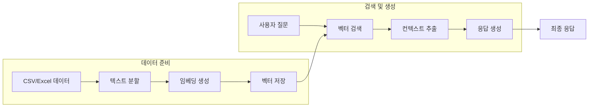

# Triple Chat 아키텍처 문서

## 시스템 아키텍처 개요

Triple Chat은 삼성 갤럭시 S25에 대한 전문 지식을 제공하는 AI 챗봇 시스템입니다. LangChain, OpenAI, ChromaDB를 활용한 RAG(Retrieval Augmented Generation) 아키텍처를 기반으로 구축되었습니다.

## 시스템 워크플로우 다이어그램

### 1. 전체 시스템 아키텍처



### 2. 챗봇 메시지 처리 흐름



### 3. RAG (Retrieval Augmented Generation) 프로세스



## 핵심 컴포넌트

### 1. Streamlit 프론트엔드
- 사용자 인터페이스 제공
- 세션 관리
- 실시간 메시지 처리
- 이미지 표시 기능

### 2. Django 백엔드
- REST API 엔드포인트
- RAG 파이프라인 관리
- 사용자 세션 처리
- 벡터 저장소 연산

### 3. 데이터 저장소
- Redis: 세션 및 메시지 기록
- ChromaDB: 벡터 데이터 저장
- SQLite: 메타데이터 및 로그

### 4. 외부 서비스
- OpenAI API
  - text-embedding-ada-002: 텍스트 임베딩
  - gpt-3.5-turbo-1106: 채팅 응답 생성

## 주요 기능 구현

### 1. RAG 구현
```python
def get_rag_context(question: str) -> Dict[str, Any]:
    embeddings = OpenAIEmbeddings()
    vector_store = Chroma(
        persist_directory=settings.VECTOR_STORE_PATH,
        embedding_function=embeddings
    )
    search_results = vector_store.similarity_search(question, k=3)
    context = "\n".join([doc.page_content for doc in search_results])
    return {
        "context": context,
        "image_paths": [doc.metadata["image_path"] for doc in search_results]
    }
```

### 2. 메시지 처리
```python
prompt = ChatPromptTemplate.from_messages([
    ("system", """You are a friendly Korean AI assistant..."""),
    MessagesPlaceholder(variable_name="history"),
    ("human", "{question}"),
])

chain = prompt | model | output_parser
chain_with_history = RunnableWithMessageHistory(
    chain,
    history_session_handler,
    input_messages_key="question",
    history_messages_key="history",
)
```

## 데이터 흐름

### 1. 사용자 입력 처리
1. Streamlit UI에서 사용자 입력 수집
2. Django API로 전송
3. 세션 검증 및 컨텍스트 검색
4. AI 응답 생성 및 반환

### 2. 데이터 저장
1. 메시지 이력: Redis
2. 벡터 데이터: ChromaDB
3. 메타데이터: SQLite

## 보안 및 성능

### 1. 보안 구현
- 세션 기반 사용자 관리
- API 요청 제한 (rate limiting)
- 환경 변수 기반 설정

### 2. 성능 최적화
- 벡터 검색 최적화 (k=3)
- 비동기 메시지 처리
- 이미지 캐싱

## 모니터링 및 로깅

### 1. 로깅 구현
```python
logging.basicConfig(level=logging.INFO)
logger = logging.getLogger(__name__)
```

### 2. 에러 처리
- OpenAI API 오류 처리
- 세션 만료 처리
- 데이터베이스 연결 오류 처리

## 확장성 고려사항

### 1. 데이터 확장
- 새로운 제품 데이터 추가 용이
- 벡터 저장소 확장 가능
- 다국어 지원 가능

### 2. 시스템 확장
- 컨테이너화 지원
- 로드 밸런싱 가능
- 분산 처리 지원
